# Домашнее задание к занятию 5 «Тестирование roles»

---

## Molecule

Запуск `molecule test -s ubuntu_xenial` и вывод команды:
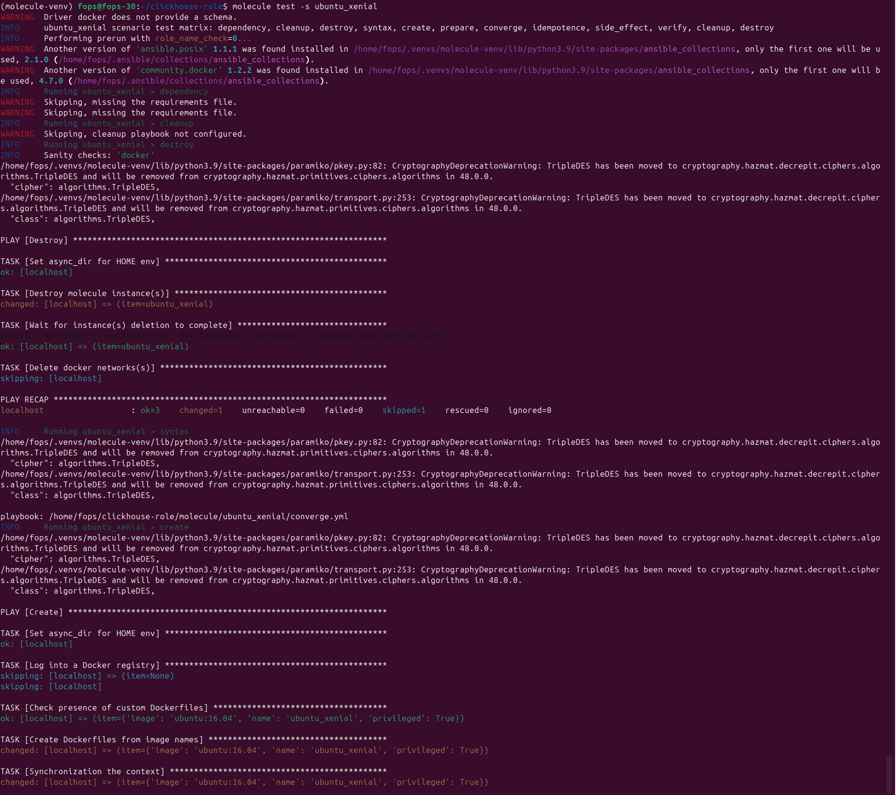
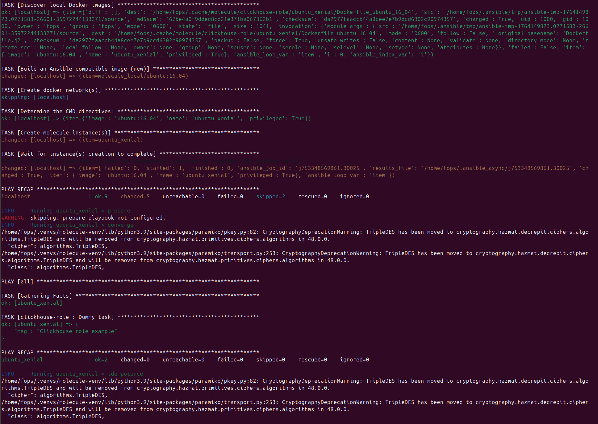
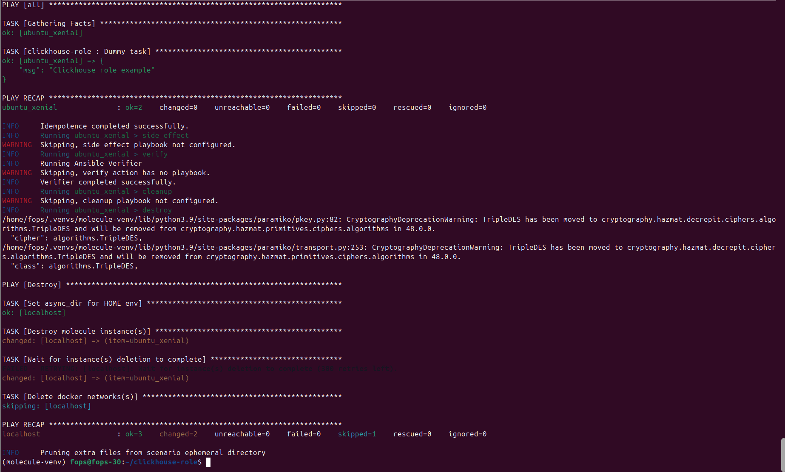

Создание сценария `default` при помощи `molecule init scenario`
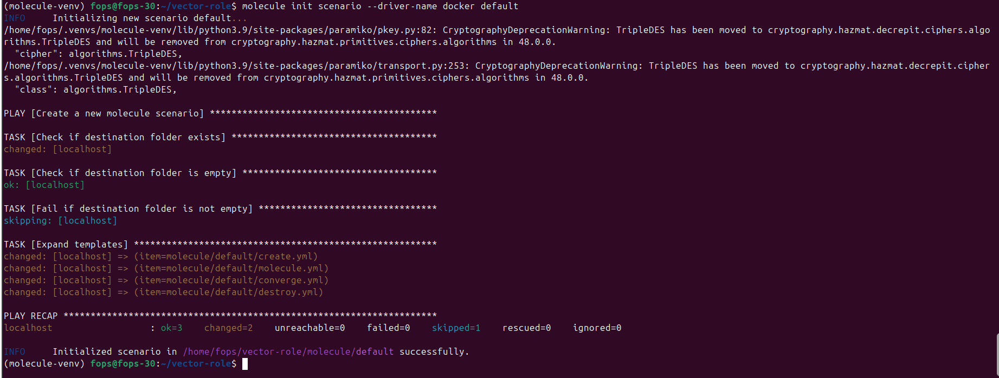

Запуск тестирования сценария:
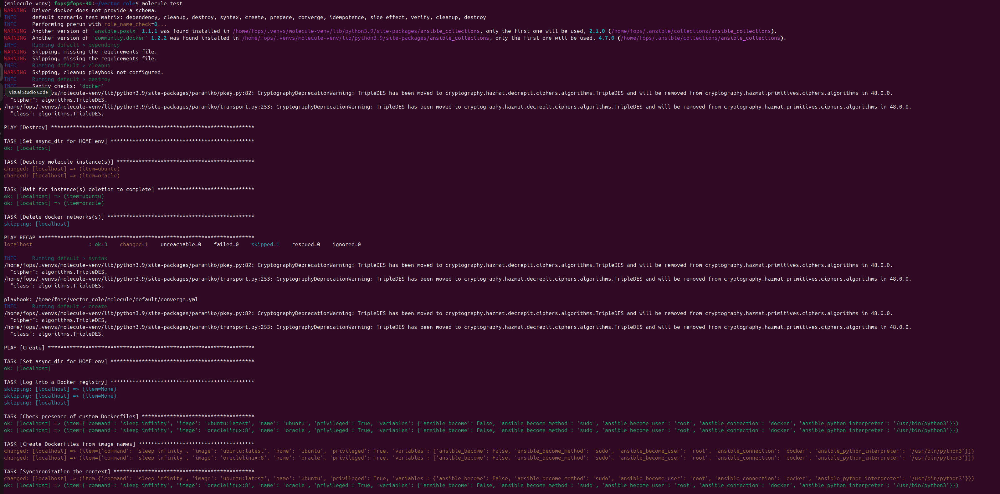
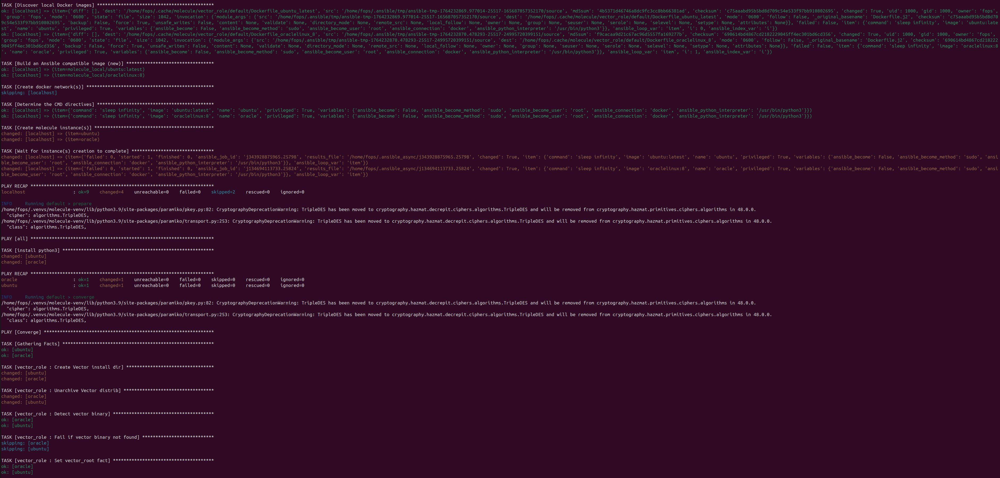
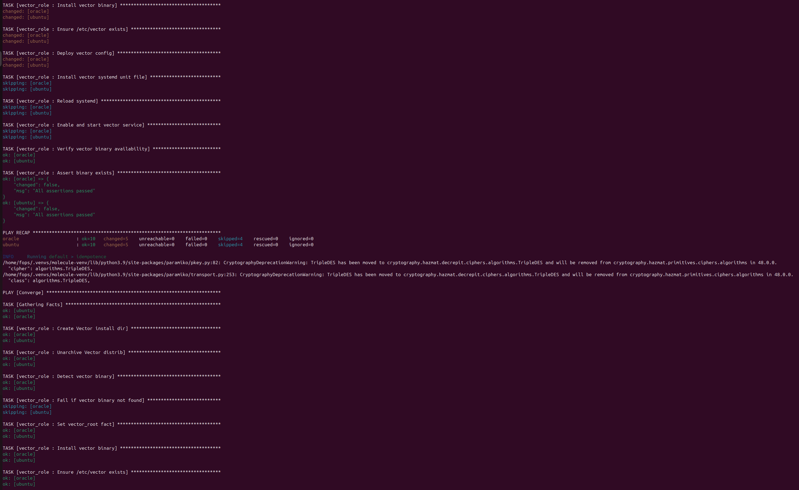
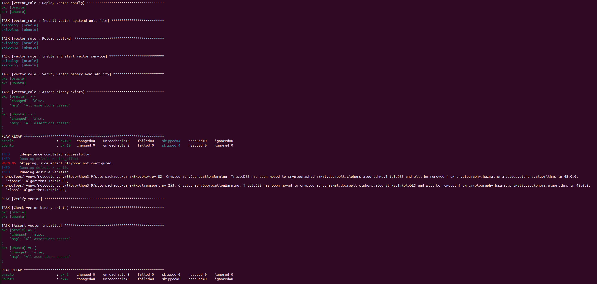
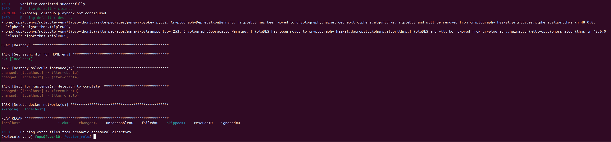

Тег на коммит с рабочим сценарием `git tag -a v1.0.1 -m "Release 1.0.1"`

---

## Tox

Все отработало успешно после выполнения команды `tox`
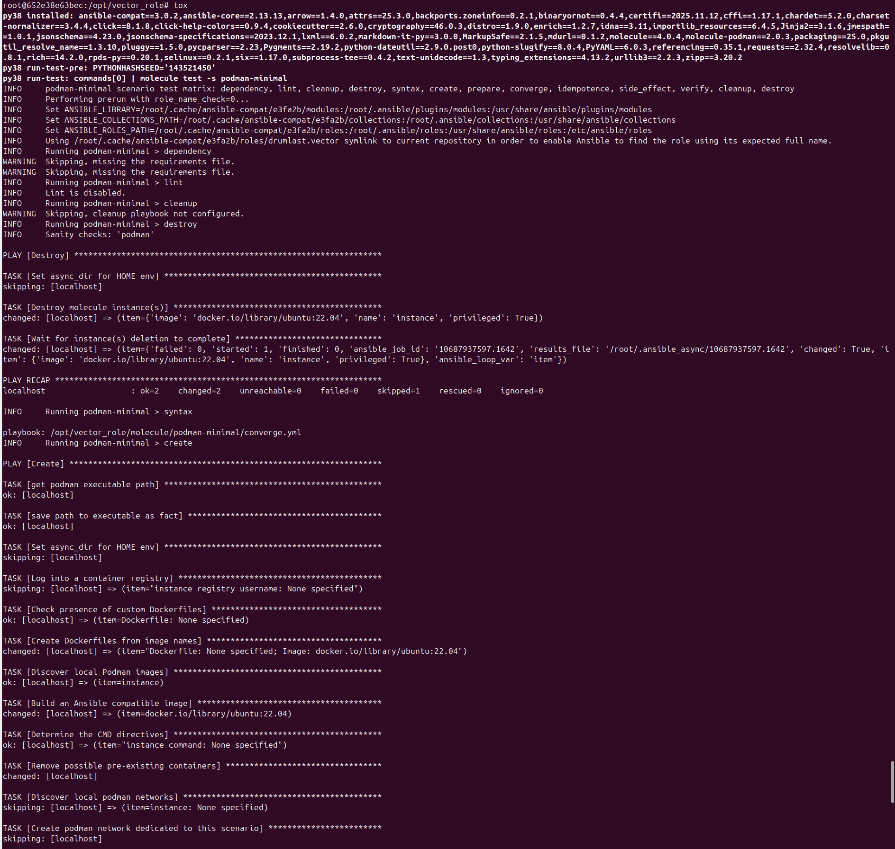
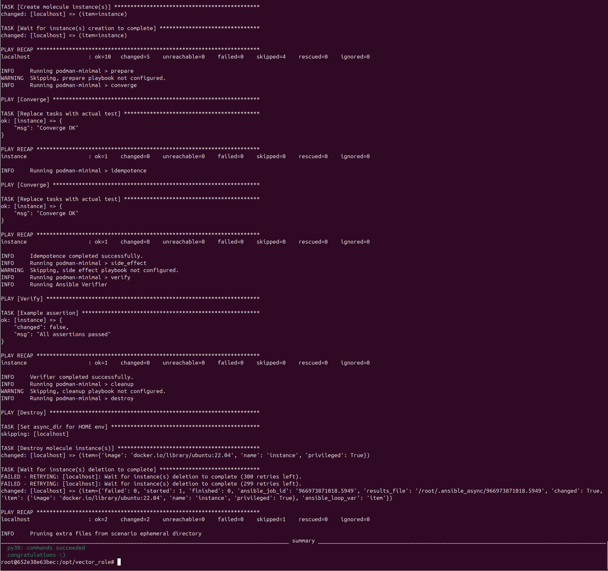

Тег на коммит с рабочим сценарием `git commit -m "Tox molecule_podman` - `git tag -a v1.0.0`